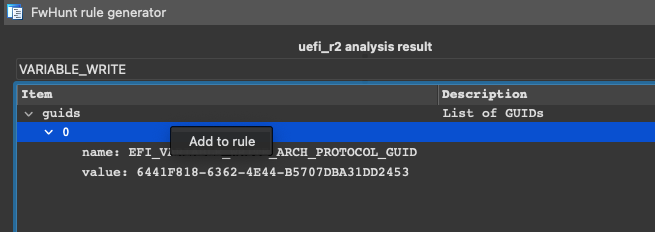
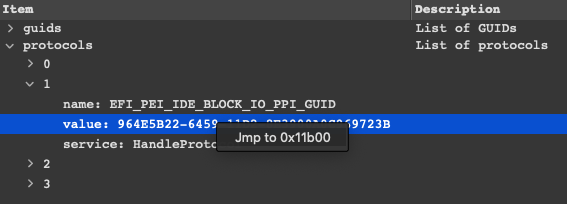
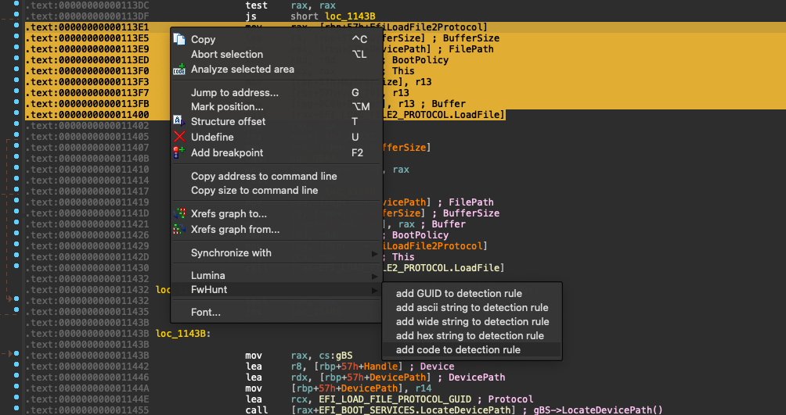
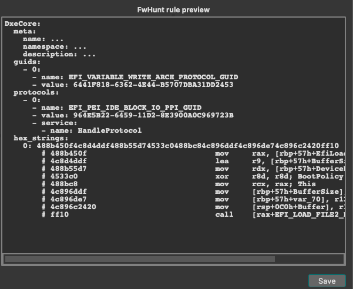

## FwHunt IDA plugin

### Installation

Copy `fwhunt.py` and `fwhunt` to IDA plugins directory

### Usage

* Analyze UEFI module with [fwhunt-scan](https://github.com/binarly-io/fwhunt-scan)
* Open analyzed module in IDA
* Open `Edit/Plugins/FwHunt` (at this step you will see `FwHunt rule generator` window):

    

* Press the `Load` button to load the report generated in the first step
* Use the search box to find the protocols, GUIDs, PPIs, NVRAM variables you need
    - you can add them to the `FwHunt rule` by right-clicking:

        

    - you can find them in the IDA database:

        

* Use actions in IDA text view to add GUIDs, ascii strings, wide strings, hex strings, and code patterns:

    

* `FwHunt rule preview` window will contain the current state of the rule:

    

* Use `Reset` button to clear rule and `Save` button to dump rule in YAML file
